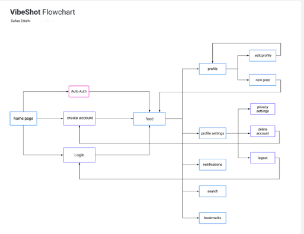

# VibeShot

**VibeShot** est une plateforme de réseautage social innovante qui combine simplicité, beauté et partage de bons moments à travers des images et des vidéos. Ce projet vise à offrir une expérience élégante et organisée aux utilisateurs tout en partageant leurs souvenirs.

---

## 🚀 Présentation du projet

### 🎯 Contexte
VibeShot est un espace dédié aux jeunes actifs, où ils peuvent publier et explorer du contenu visuel captivant, tout en interagissant avec d'autres utilisateurs dans un environnement épuré.

### 🌟 Objectifs
- Organiser les publications de manière stylée.
- Satisfaire les utilisateurs grâce à une expérience fluide.
- Partager facilement des souvenirs.

### 📱 Périmètre
Le site sera entièrement **Responsive Design**, garantissant une expérience utilisateur optimale sur tous les appareils.

---

## 🎯 Cibles
- Âge : 13 ans et plus.
- Public : Utilisateurs du monde entier.

---

## 🔍 Concurrence
Les plateformes concurrentes principales sont :
- **Instagram**
- **Pinterest**

---

## 🎨 Charte graphique et ergonomique

### 🖼️ Logo

### 🖋️ Typographie
Les polices utilisées sont :
- **Inter**
- **Poppins**
- **Roboto**

### 🎨 Couleurs  
- Fond : `#000`  
- Texte : `#D9D9D9`  
- Boutons : `#38b6ff`

---

## 🕒 Délais de réalisation
Le projet sera officiellement lancé en **mai 2025**.

---

## ⚙️ Spécifications fonctionnelles

1. Poster des images et vidéos.
2. Partager des articles.
3. Réagir aux publications (likes, commentaires).
4. Suivre d'autres utilisateurs.
5. Navigation dans le fil d'actualité.
6. Tableau de bord personnalisé.

---

## 📋 Description fonctionnelle

- **Fil d'actualité (Feed)** : Ajouter de nouveaux posts et afficher des posts pertinents.
- **Profil** : Voir et gérer les informations personnelles et publications (modifier, ajouter, supprimer).
- **Navigation** : Rechercher des utilisateurs, publications, etc.
- **Notifications** : Recevoir des alertes importantes (likes, commentaires, etc.).
- **Favoris (Bookmarks)** : Voir les posts enregistrés par l'utilisateur.
- **Paramètres** : Gérer le compte (déconnexion, suppression du compte).

---
## Technologies utilisées

### 1. Frontend
- **React.js** : Pour une interface utilisateur dynamique et réactive.
- **Tailwind CSS** : Pour un design responsive et moderne.
- **Sass** : Préprocesseur CSS permettant une gestion plus flexible et modulaire des styles, avec des variables, des mixins, des fonctions, et des imbrications, facilitant ainsi l'évolutivité du design.

### 2. Backend
- **Laravel** : Framework PHP pour la gestion du backend et des API.
- **MySQL** : Base de données relationnelle pour stocker les données utilisateur et les publications.

### 3. Outils de développement
- **Git** : Système de contrôle de version pour suivre et gérer les modifications du code.
- **GitHub** : Plateforme de gestion de code source en ligne pour la collaboration et le déploiement du projet.
- **Jira** : Outil de gestion de projet pour la planification, le suivi des tâches et la gestion des workflows.

---

## Timeline du projet VibeShot

#### **Janvier 2025 : Planification et Cahier des charges**
- **Dernière semaine** : Utilisation de **Jira** pour la planification des tâches et suivi du projet et Réalisation du cahier des charges.

#### **Février 2025 : Conception et maquettage**
- **Semaine 1** : Conception UML (diagrammes de cas d’utilisation, diagrammes de classe).
- **Semaine 2** : Création des maquettes.
- **Semaine 3-4** : Développement de la base de données, modélisation et implémentation des schémas de données.

#### **Mars 2025 : Développement frontend et backend**
- **Semaine 1-3** : Développement du frontend.
- **Semaine 3-4** : Développement du backend.

#### **Avril 2025 : Finalisation et tests**
- **Semaine 1-3** : Finalisation du développement frontend et backend.
- **Semaine 4** : Tests de l’application.

#### **Mai 2025 : Lancement**
- Lancement officiel de la plateforme.

---

## Réalisé par Safaa Ettalhi

