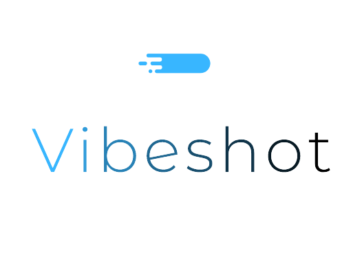
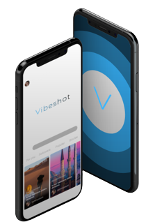

# VibeShot

**VibeShot** est une plateforme de réseautage social innovante qui combine simplicité, beauté et partage de bons moments à travers des images et des vidéos. Ce projet vise à offrir une expérience élégante et organisée aux utilisateurs tout en partageant leurs souvenirs.

---

## 🚀 Présentation du projet

### 🎯 Contexte
VibeShot est un espace dédié aux jeunes actifs, où ils peuvent publier et explorer du contenu visuel captivant, tout en interagissant avec d'autres utilisateurs dans un environnement épuré.

### 🌟 Objectifs
- Organiser les publications de manière stylée.
- Satisfaire les utilisateurs grâce à une expérience fluide.
- Partager facilement des souvenirs.

### 📱 Périmètre
Le site sera entièrement **Responsive Design**, garantissant une expérience utilisateur optimale sur tous les appareils.

---

## 🎯 Cibles
- Âge : 13 ans et plus.
- Public : Utilisateurs du monde entier.

---

## 🔍 Concurrence
Les plateformes concurrentes principales sont :
- **Instagram**
- **Pinterest**

---

## 🎨 Charte graphique et ergonomique

### 🖼️ Logo

### 🖋️ Typographie
Les polices utilisées sont :
- **Inter**
- **Poppins**
- **Roboto**

### 🎨 Couleurs
**Mode clair** :  
- Fond : `#fff`  
- Texte : `#1e293b`  
- Boutons : `#38b6ff`  

**Mode sombre** :  
- Fond : `#000`  
- Texte : `#D9D9D9`  
- Boutons : `#38b6ff`

---

## 🕒 Délais de réalisation
Le projet sera officiellement lancé en **mai 2025**.

---

## ⚙️ Spécifications fonctionnelles

1. Poster des images et vidéos.
2. Partager des articles.
3. Réagir aux publications (likes, commentaires).
4. Suivre d'autres utilisateurs.
5. Navigation dans le fil d'actualité.
6. Tableau de bord personnalisé.

---

## 📋 Description fonctionnelle

- **Fil d'actualité (Feed)** : Ajouter de nouveaux posts et afficher des posts pertinents.
- **Profil** : Voir et gérer les informations personnelles et publications (modifier, ajouter, supprimer).
- **Navigation** : Rechercher des utilisateurs, publications, etc.
- **Notifications** : Recevoir des alertes importantes (likes, commentaires, etc.).
- **Favoris (Bookmarks)** : Voir les posts enregistrés par l'utilisateur.
- **Paramètres** : Gérer le compte (déconnexion, suppression du compte).

---

